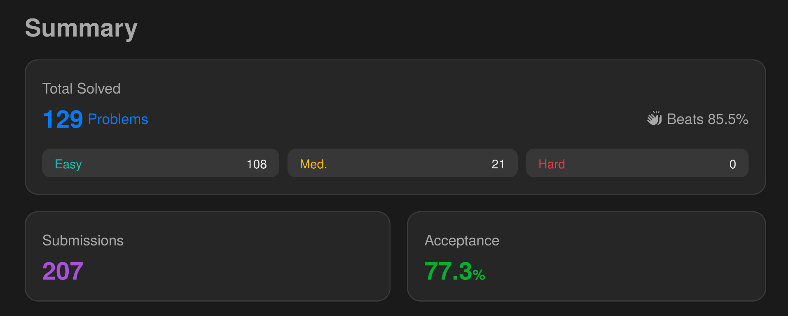

# LeetCode.ts
## Mais de 100 problemas do [LeetCode](https://leetcode.com/) resolvidos utilizando TypeScript



## Sobre
O projeto foi desenvolvido pensando no aprendizado da linguagem ao redor de **estruturas de dados** e **algoritmos**.

Sem conhecimento prévio em TS, os conceitos foram pesquisados e aplicados de acordo com o problema.

## Tópicos
Os problemas foram divididos em pastas que representam o assunto abordado e nomeados de acordo com o número no LeetCode:
- [Arrays](src/array)
- [Backtracking](src/backtracking)
- [Binary Search](src/binary-search)
- [Binary Tree](src/binary-tree)
- [DFS](src/dfs)
- [Dynamic Programming](src/dynamic-programming)
- [Graph](src/graph)
- [Heap](src/heap)
- [Linked List](src/linked-list)
- [Queue](src/queue)
- [Recursion](src/recursion)
- [Sliding Window](src/sliding-window)
- [Sorting](src/sorting)
- [Stack](src/stack)
- [String](src/string)
- [Trie](src/trie)
- [Two Pointers](src/two-pointers)

## Como executar os arquivos
### Requisitos
- [Git](https://git-scm.com/)
- [Node.js](https://nodejs.org)
  - Versão utilizada: 10.9.2

### Clone o repositório e instale as dependências
```bash
   $git clone https://github.com/GuilhermeQuirinoCruz/leetcode-ts.git
   $ cd leetcode-ts
   
   $ npm init
   $ npm i package.json
   # confirme todas as opções ou altere conforme achar necessário
```

### Execute um arquivo
Estando na pasta raíz do projeto:
```bash
   $ npx tsx ./src/[nome-da-pasta]/[nome-do-arquivo].ts

   # Exemplo
   $ npx tsx ./src/array/1470.ts
```
